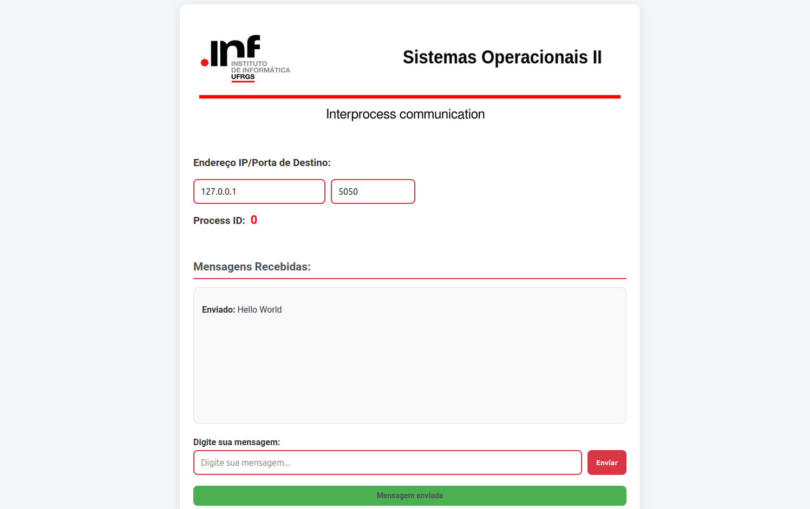

# Interprocess Communication
This code implements a communication system between two processes using sockets, with synchronization managed by vector clocks. In this system, the processes exchange messages over a network, where sockets serve as the communication channel, facilitating the transmission of data. Vector clocks, a key mechanism in distributed systems, are used to maintain the logical ordering of events across the processes. Each process maintains a vector timestamp that tracks the causal relationships between events in the system, ensuring that message delivery follows a consistent order, even in the absence of a global clock. This allows the system to detect and handle concurrency and causality violations, ensuring synchronized communication and correct message sequencing.

## 1. Steps to Install:


### 1. Upgrade and update
   ```bash   
   sudo apt-get update
   sudo apt-get upgrade 
   ```
### 2. Installation of application and internal dependencies

    git clone https://github.com/kayua/VectorialClock-SysOp.git
    pip install -r requirements.txt

   
## 2. Run experiments:


### 1. Run (main.py) Server Mode
    
    python3 main.py (arguments)
    Example: python3 main.py --process_id (ID Process) --listen_port 5050 --send_port 5050 --flask_port 5000 --address (IP Address)
    

### Input parameters:

    Arguments:

        --process_id            Process ID ()
        --number_processes      Number of processes
        --listen_port           Listening message port
        --send_port             Sending message port 
        --max_delay             Maximum delay communication
        --max_retries           Maximum retries message send
        --address               Local IP Address
        --flask_port            Flask port for frontend/backend communication
    --------------------------------------------------------------


## 3. Implemented semantics



## 4. Requirements:

`pyfiglet 1.0.2`
`logging`